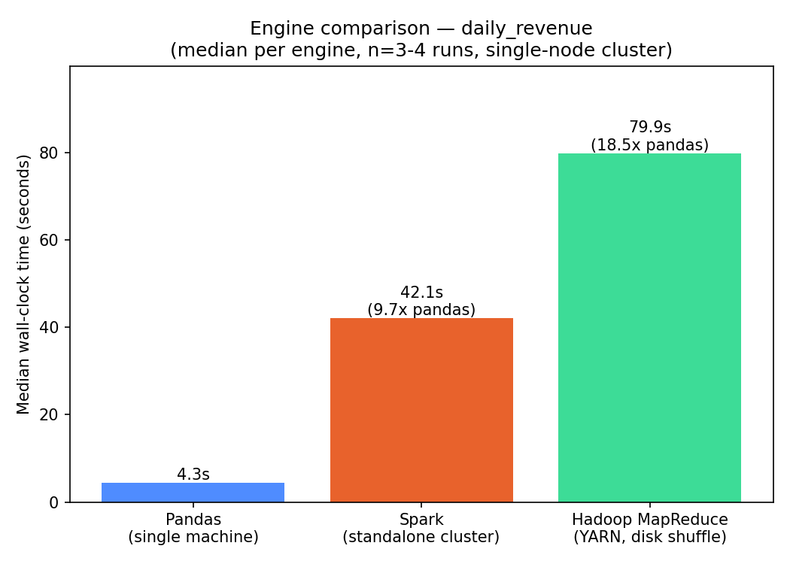
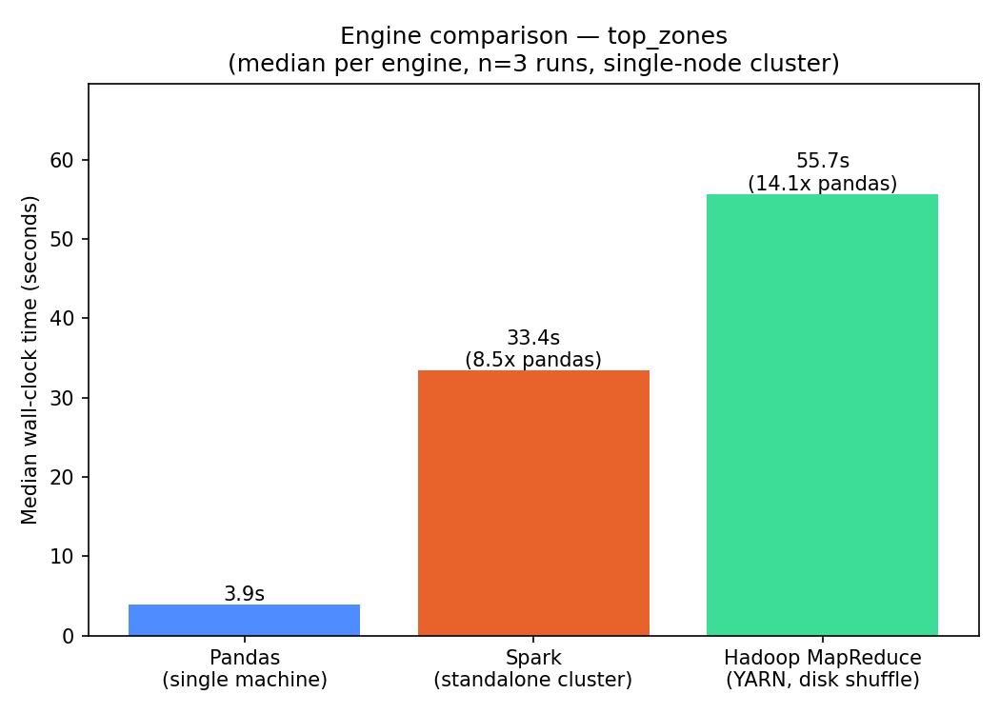

# Distributed Workload Benchmark: Pandas vs Spark vs Hadoop MapReduce

A reproducible benchmark suite that runs the **same analytical queries** against
2.87M NYC Yellow Taxi trip records using three different execution engines —
a single-machine pandas baseline, a Spark standalone cluster, and Hadoop
MapReduce (via Hadoop Streaming) on YARN — and measures real wall-clock time
for each.

The whole cluster (HDFS + YARN + Spark) runs locally via Docker Compose, so
anyone who clones this repo can reproduce the numbers below on their own
machine — no cloud account or bill required.

## Why this exists

"I benchmarked Spark on a cloud cluster and got a speedup" is a claim you
can't verify. This repo is the opposite: a CLI you can run yourself, a
results log with every trial recorded, and an honest writeup of what
actually happened when Spark and Hadoop's real overheads showed up at
this scale — including the two times a job was slower than doing nothing
distributed at all.

## Architecture

```
                         ┌─────────────────────────────────────────┐
                         │              Docker network              │
                         │                                          │
  data/download_dataset.py     ┌──────────┐        ┌──────────────┐ │
   (NYC TLC → cleaned CSV) ───▶ │ NameNode │◀──────▶│  DataNode(s) │ │
                         │      │  :9870   │        │              │ │
                         │      └────┬─────┘        └──────────────┘ │
                         │           │ HDFS                          │
                         │      ┌────▼──────────┐   ┌──────────────┐ │
                         │      │ResourceManager│──▶│ NodeManager  │ │
                         │      │    :8088      │   │  (+ python3) │ │
                         │      └───────────────┘   └──────┬───────┘ │
                         │                          runs MapReduce   │
                         │                          mapper/reducer   │
                         │                          tasks (YARN)     │
                         │                                          │
                         │      ┌───────────────┐   ┌──────────────┐ │
                         │      │ Spark Master  │──▶│ Spark Worker │ │
                         │      │    :8080      │   │              │ │
                         │      └───────────────┘   └──────────────┘ │
                         └─────────────────────────────────────────┘
                                          ▲
                                          │ spark-submit / hadoop jar
                              benchmark/cli.py  (times wall-clock,
                                                  records to results.csv)
```

Single-node "pseudo-distributed" Hadoop (NameNode + DataNode +
ResourceManager + NodeManager all run, just on one host) plus a Spark
standalone cluster (master + worker), sized to fit a memory-constrained
dev machine (8GB RAM, ~3.7GB given to Docker). Node count is a config
knob (`docker compose up --scale spark-worker=N`), not a hard limit —
what's being measured here is the *architectural* difference between
disk-based MapReduce shuffles and Spark's in-memory DAG execution, which
holds regardless of cluster size.

## Repo layout

```
docker/                     docker-compose.yml (Hadoop + Spark cluster)
data/download_dataset.py    downloads + cleans NYC TLC trip data
queries/
  baseline_pandas/          single-machine implementation per query
  spark/                    PySpark DataFrame implementation per query
  hadoop_mapreduce/         Hadoop Streaming mapper.py / reducer.py per query
benchmark/
  runners.py                subprocess wrappers that time each engine
  cli.py                    `python -m benchmark.cli run/report`
  chart.py                  generates results/plots/*.png
results/
  results.csv                every recorded run (raw data, not just medians)
  plots/                     generated comparison charts
```

## Queries implemented

| Query | Pattern | What it does |
|---|---|---|
| `daily_revenue` | pure aggregation | groupBy(pickup_date): trip count, total fare/tip/revenue, avg distance |
| `top_zones` | join + aggregation + top-N | joins trips against the (tiny) zone lookup table, ranks pickup zones by trip count |

`top_zones` is implemented as a **broadcast / map-side join** in every
engine, since the lookup table is ~12KB: Spark via an explicit
`F.broadcast()` hint, MapReduce via Hadoop's distributed cache with the
lookup loaded into an in-memory dict inside the mapper. This avoids a
shuffle-based join in both cases — a deliberate optimization, not an
accident.

## Running it yourself

```bash
# 1. Download and clean the dataset (~230MB CSV, ~2.87M rows)
pip install -r requirements.txt
python data/download_dataset.py --month 2024-01

# 2. Bring up the cluster
cd docker
docker build -f nodemanager.Dockerfile -t bench-nodemanager-py:latest .
docker compose up -d --scale spark-worker=1

# 3. Load data into HDFS
docker exec bench-namenode hdfs dfs -mkdir -p /benchmark/input
docker exec bench-namenode hdfs dfs -put /workspace/data/raw/trips_2024-01.csv /benchmark/input/trips.csv
docker exec bench-namenode hdfs dfs -put /workspace/data/raw/taxi_zone_lookup.csv /benchmark/input/zones.csv

# 4. Run the benchmark
cd ..
python -m benchmark.cli run --query daily_revenue --engine all
python -m benchmark.cli run --query top_zones --engine all
python -m benchmark.chart
```

Cluster UIs: HDFS NameNode `localhost:9870`, YARN ResourceManager
`localhost:8088`, Spark Master `localhost:8080`.

## Methodology

- **Timing is end-to-end wall-clock**, from process invocation to exit —
  including JVM/cluster startup overhead. That overhead is real cost a
  user pays every time they run a job, not something to hide from the
  numbers.
- Each (engine, query) pair was run **3–4 times**; `results.csv` keeps
  every trial, and `benchmark/chart.py` reports the **median** to reduce
  noise from container scheduling/GC pauses on a resource-constrained
  single machine (one `daily_revenue` pandas run hit 19.7s once, clearly
  a system-noise outlier next to three ~3-5s runs — kept in the raw log,
  excluded by the median).
- All three engines were verified to produce **identical results**
  (same 35 dates / same 256 zones, matching sums to the cent) before any
  timing was recorded — correctness before speed.

## Results

### `daily_revenue` (pure aggregation, 2.87M rows)



| Engine | Median | vs. pandas |
|---|---|---|
| Pandas (single machine) | 4.3s | baseline |
| Spark (standalone, 1 executor) | 42.1s | 9.7x slower |
| Hadoop MapReduce (YARN) | 79.9s | 18.5x slower |

### `top_zones` (broadcast join + top-N, 2.87M rows)



| Engine | Median | vs. pandas |
|---|---|---|
| Pandas (single machine) | 3.9s | baseline |
| Spark (standalone, 1 executor) | 33.4s | 8.5x slower |
| Hadoop MapReduce (YARN) | 55.7s | 14.1x slower |

## The actual finding

At **this** data volume and cluster size, pandas wins and both
distributed engines lose to it — and that's the correct, textbook
result, not a bug. Spark and MapReduce both pay fixed costs
(JVM startup, YARN container allocation, task scheduling) that a single
pandas process never incurs. Those costs are roughly constant regardless
of data size, so they dominate at a few hundred MB and amortize away as
data grows into the tens/hundreds of GB — which is exactly why these
engines exist for data that no longer fits comfortably in one machine's
memory, not for data that does.

The gap *between* the two distributed engines is the more interesting
result: **Spark beats Hadoop MapReduce by roughly 1.7–1.9x** on identical
logic and identical hardware, because Spark keeps intermediate data
in-memory across a DAG of stages while MapReduce writes shuffle output
to disk between every map and reduce phase, and launches a fresh JVM per
task rather than reusing executor processes. That's the architectural
difference this benchmark actually demonstrates.

